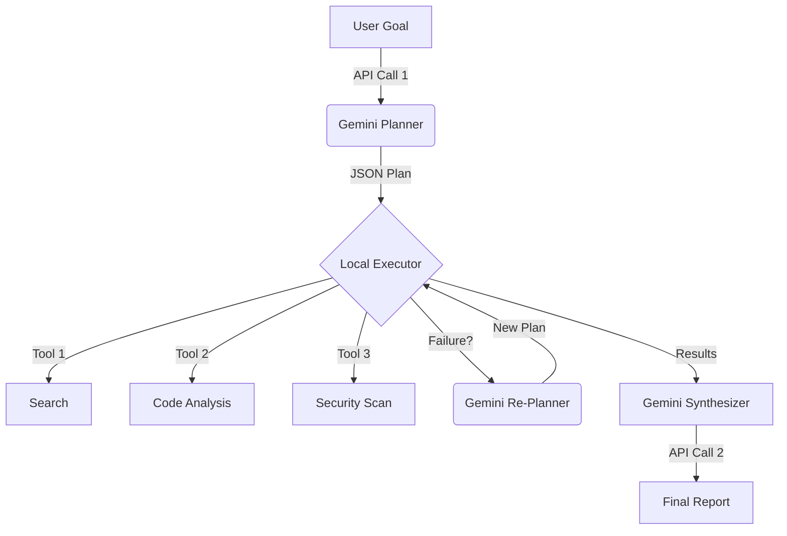

# Repo Mind - AI-Powered Repository Analyzer

Repo Mind is an advanced CLI tool and API that leverages Google Gemini (2.0 Flash Thinking) and CodeQL to perform deep, semantic, and security analysis of codebases. It goes beyond simple linting by "thinking" about architecture, security flaws, and code context.

## 🚀 Features

- **Ingest**: Recursively clone and process local or remote (Git) repositories.
- **Deep Analysis**: Uses Gemini 2.0 Thinking Mode to plan and execute multi-step investigations.
- **Security Audit**: Integrates GitHub CodeQL for static analysis and vulnerability detection.
- **Orchestration**: A smart orchestrator that plans, executes, and persists analysis workflows.
- **Evidence-Based**: Verifies all AI-cited code against the actual repository to prevent hallucinations.

## 🏗️ Architecture: Adaptive Macro-Planning

This project strictly adheres to the **Gemini 3 Free Tier (5 RPM limit)** by using a unique "Dual-Gear" architecture:



## 📋 Prerequisites

- **Python 3.11+**
- **Git** (for repository operations)
- **CodeQL CLI** (Optional, for deep security scanning)
- **Gemini API Key** (Required for AI features)

## 🛠️ Setup Guide

### 1. Installation

Clone the repository and install dependencies:

```bash
git clone <your-repo-url>
cd cli
pip install -r requirements.txt
```

### 2. Configuration

Create a `.env` file from the example:

```bash
cp .env.example .env
```

Edit `.env` and add your **GEMINI_API_KEY**. You can mostly keep other defaults.

```env
GEMINI_API_KEY=your_key_here
ORCHESTRATOR_SECRET_KEY=dev-secret-key...
WORKSPACE_DIR=workspace
```

### 3. (Optional) Install CodeQL

Run the setup script to download and configure CodeQL automatically:

```powershell
# Windows (PowerShell)
.\setup_codeql.ps1
```

---

## 🏃 Run the Application

The application, "Repo Mind," runs as a FastAPI server.

### Start the Server

```bash
uvicorn main:app --reload
```
*Server will listen on `http://localhost:8000`*

---

## 🎮 Usage & Verification

We provide a **Manual Test Kit** to verify the entire pipeline (Ingest -> Plan -> Execute) interactively.

### Run the Test Kit

With the server running in one terminal, open another and run:

```bash
python manual_test_kit.py
```

**What you can do:**
1.  **Ingest Repository**: Point it to a local folder (e.g., this project itself `d:/projects/cli`) to ingest it.
    - *Verify*: You see "Ingest Success" and a `repo_id`.
2.  **Run Deep Analysis**: Enter a natural language query like *"Find security vulnerabilities in the auth module"*.
    - The system will **Plan** an investigation (Creation -> HMAC Signature).
    - It will **Execute** the plan using Gemini Thinking and CodeQL.
    - It will **Print** the findings interactively.
    - *Verify*: Look for the "GEMINI FINDINGS" section with specific issues and lines of code.

---

## 🧪 Testing

Run the automated test suite to ensure system integrity:

```bash
# Run full integration suite (Phase 3)
pytest tests/test_phase3_integration.py -v

# Run all tests
pytest
```

## 📂 Project Structure

- `api/`: FastAPI routers and endpoints.
- `services/`: Core logic (Gemini, CodeQL, Ingest, Orchestrator).
- `models/`: Pydantic data models for requests/responses.
- `utils/`: Helpers for logging, metrics, and validation.
- `workspace/`: Storage for ingested repos, indexes, and analysis plans.
- `tests/`: Unit and integration tests.

## 📚 Documentation

- **[build.md](build.md)**: Comprehensive development log and module status.
- **[error.md](error.md)**: Log of known errors and their resolutions.
